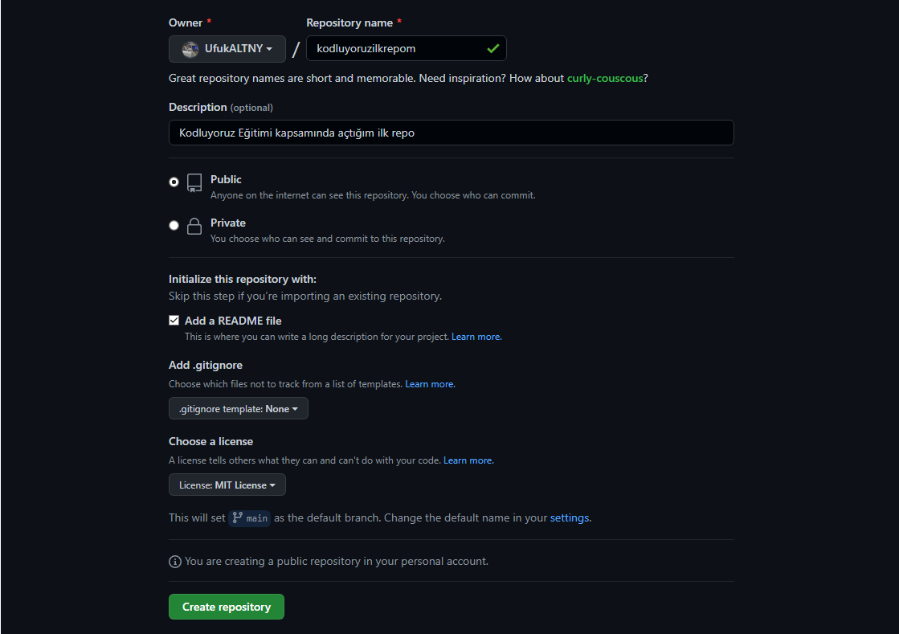

# Kodluyoruz Ilk Repo
[Kodluyoruz](https://kodluyoruz.org/tr/kodluyoruz/) Front-End Eğitimi kapsamında açtığım ilk repo ve içerisinde bir adet README dosyası, bir adet de index.html barındırıyor.

## Installation
Öncelikle projeyi clonelayın. (Buraya sizin reponuzdan aldığınız link gelecek)

`git clone https://github.com/UfukALTNY/kodluyoruzilkrepo.git`
## Usage

Projeyi cloneladıktan sonra Visual Studio Code programında açınız.

**Linux için:**

`cd kodluyoruzilkrepo
code .`
## Contributing
Pull requestler kabul edilir. Büyük değişiklikler için, lütfen önce neyi değiştirmek istediğinizi tartışmak için bir konu açınız.
## License
[MIT](https://choosealicense.com/licenses/mit/)

